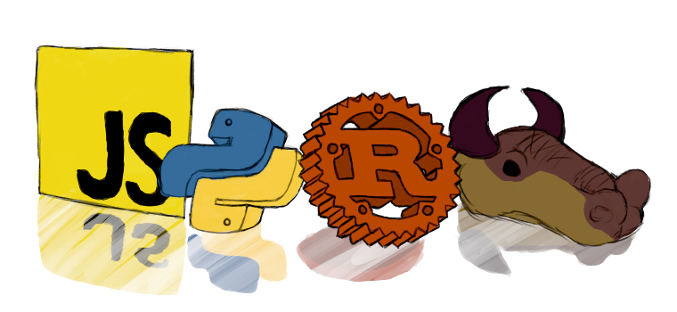

Made with [Krita](https://krita.org). (Copyright 2021-)

## Experience

### Engineering
+ Optimal Design
+ Linkage Mechanisms
+ Computer Vision
+ Machine Learning

### Software Translation (en-US, zh-TW)
+ [0 A.D.](https://www.transifex.com/wildfire-games/0ad/dashboard/)

### Repositories ([Gist](https://gist.github.com/KmolYuan))
+ [Pyslvs-UI](https://github.com/KmolYuan/Pyslvs-UI):
  Planar linkage mechanism simulation and mechanical synthesis system.
  + type: GUI, kernel selectable (main library: [pyslvs](https://github.com/KmolYuan/pyslvs))
  + techniques: Python (PyQt), Cython, C++
+ [Python-Solvespace](https://github.com/KmolYuan/solvespace):
  Python wrapper for the kernel of Solvespace, which is a CAD software.
  + type: Wrapper, library
  + techniques: Python, Cython
+ [apimd](https://github.com/KmolYuan/apimd):
  A Python API compiler for universal Markdown syntax.
  + type: CLI
  + techniques: Pure Python
+ [yaml-peg](https://github.com/KmolYuan/yaml-peg-rs):
  A YAML 1.2 parser using a greedy parsing algorithm with PEG atoms.
  + type: Library
  + techniques: Pure Rust
+ [reveal-yaml](https://github.com/KmolYuan/reveal-yaml-rs):
  Create a Reveal.js presentation simply via a YAML file and some local resources. (**CLI**)
  + type: CLI, remade from Python
  + techniques: Rust (Actix), JavaScript (jQuery), CSS, HTML
+ [efd](https://github.com/KmolYuan/efd-rs):
  Elliptical Fourier Descriptor (EFD) implementation in Rust.
  + type: Library
  + techniques: Pure Rust
+ [metaheuristics-nature](https://github.com/KmolYuan/metaheuristics-nature-rs):
  A collection of nature-inspired metaheuristic algorithms for benchmarking different optimization methods.
  + type: Library
  + techniques: Pure Rust
+ [four-bar](https://github.com/KmolYuan/four-bar-rs):
  Planar four-bar linkage mechanism simulation and mechanical synthesis system.
  + type: GUI, WebAssembly GUI
  + techniques: Rust (Actix, egui, wasm-bindgen), JavaScript
+ [latex-paper](https://github.com/KmolYuan/latex-paper): LaTex template for National Taiwan University Thesis.
  + type: Template
  + techniques: ShellScript, LaTex (pandoc CLI)

### Programming Languages (Cross-platforms)
+ Rust
+ Python (PyQt, PyTorch, Cython)
+ C99^/C++11^
+ ShellScript / Makefile / CMake / Batch file
+ Dear HTML / CSS / JavaScript
+ Matlab
+ Beginning: Go, Fortran, JVM (Kotlin and Java), dotNet (C-sharp), Haskell

### Research Published
+ 2022, [A generative model for path synthesis of four-bar linkages via uniform sampling dataset](https://doi.org/10.1177/09544062221123700)
+ 2021, [Design of a monolithic constant-force compliant mechanism for extended motion minimal force variation](https://doi.org/10.1115/DETC2021-69726)
